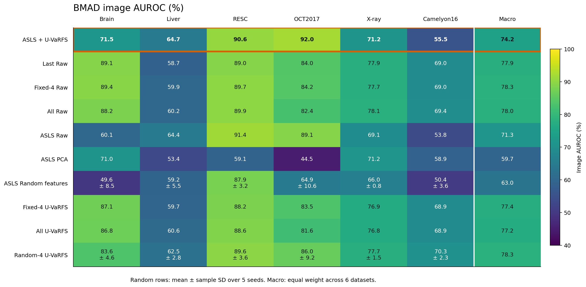
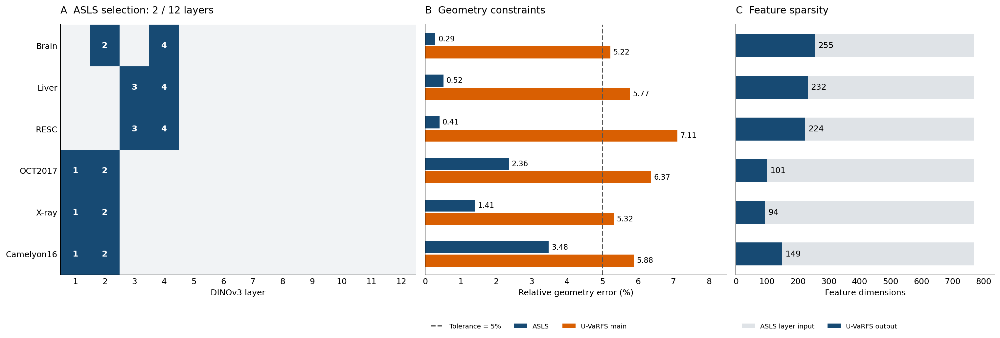

> 归档说明：本报告分析改进前的 `gpu-eval-v3-batched-uvarfs` 回传结果，代码诊断基于当时的 Git revision `a22c44a`。报告中的“当前代码/结果”均指该历史版本；后续 v4 实现修正见 [PROTOCOL_FIXES.md](../../PROTOCOL_FIXES.md)。本报告不包含 v4 真实性能实验。

# BMAD 六数据集实验分析（2026-10-06）

当前结果证明整套 GPU 实验流程已跑通、表示维度可以大幅压缩，但尚不足以支持 ASLS + U-VaRFS 在BMAD 六个医学异常检测 benchmark 上整体优于固定层或全层。ASLS 的层选择与门控行为是优先诊断对象；U-VaRFS 在 ASLS 选定层内提供了较明确的随机特征对照优势。

本报告分析 Frozen DINOv3 + Adaptive Sparse Layer Selection + U-VaRFS 的无异常标签医学异常检测研究。主线、六数据集协议、主方法身份与原始结果文件均未修改。

## 1. 结果覆盖与一致性

- 六数据集各有 18 个方法，共 108 行；全部来自 gpu-eval-v3-batched-uvarfs，无重复 dataset/method 键。
- 全局 all_metrics.csv 与各数据集 metrics.csv 一致；重新计算的 mean 和样本 SD 与 summary_metrics.csv 一致（数值差异不超过浮点精度）。
- 两类随机 baseline 均含 seeds 42、123、3407、2026、2027；下文报告五个 seed 的 mean ± SD，不选择最好 seed。
- 所有方法 memory_size=20000，完整候选维度=4608。六份 eval_progress.json 均为 complete，使用 TorchCosineIndex。
- 日志中的 train/valid/test 数量符合交接表。该次实际运行来自 Linux 的 /data/ftcl/guo/U-VaRFS；此前当前电脑的 Windows fixture 失败不能直接解释这轮结果。
- 传回目录没有运行时 config snapshot、Git SHA、每图预测、backbone 具体版本或 mask 匹配清单。可以核对当前默认配置和日志，但无法独立确认所有服务器运行细节。

## 2. 主方法结果

AUROC/AUPRC 均以百分数显示；差值单位为百分点。Macro 为六数据集等权平均，不按样本数或随机 seed 数量加权。

| 数据集 | 选中层 | 维度 | Image AUROC | Image AUPRC | 较 Fixed-4 Raw ΔAUROC | 压缩率 |
| --- | --- | --- | --- | --- | --- | --- |
| Brain | 2,4 | 255 | 71.48 | 90.37 | -17.95 | 94.47% |
| Liver | 3,4 | 232 | 64.75 | 55.71 | +4.81 | 94.97% |
| RESC | 3,4 | 224 | 90.56 | 89.88 | +0.87 | 95.14% |
| OCT2017 | 1,2 | 101 | 91.97 | 96.31 | +7.74 | 97.81% |
| X-ray | 1,2 | 94 | 71.16 | 97.85 | -6.51 | 97.96% |
| Camelyon16 | 1,2 | 149 | 55.54 | 54.34 | -13.43 | 96.77% |

主方法 Macro AUROC=74.24%，Fixed-4 Raw=78.32%，差值 -4.08 个百分点。主方法在 Liver、OCT2017、RESC 上高于 Fixed-4 Raw，在 Brain、Camelyon16、X-ray 上分别下降 17.95、13.43、6.51 个百分点。

Brain、Camelyon16、X-ray 的主方法与 Fixed-4 Raw 的边际 bootstrap AUROC 区间不重叠，下降幅度值得重视；此处不据此报告配对 p 值。Liver 和 RESC 的区间重叠，不能仅据点估计宣称统计优势。当前没有逐图配对预测，无法重新做配对 bootstrap 或患者级统计。

| 方法家族 | Macro AUROC | Macro AUPRC | 平均维度 |
| --- | --- | --- | --- |
| Fixed-4 Raw | 78.32 | 82.02 | 1536.0 |
| Random-4 U-VaRFS | 78.27 | 82.24 | 243.1 |
| All Raw | 78.02 | 81.58 | 4608.0 |
| Last Raw | 77.95 | 81.42 | 384.0 |
| Fixed-4 U-VaRFS | 77.37 | 80.99 | 218.8 |
| All U-VaRFS | 77.23 | 81.17 | 256.0 |
| ASLS + U-VaRFS | 74.24 | 80.74 | 175.8 |
| ASLS Raw | 71.32 | 79.36 | 768.0 |
| ASLS Random features | 63.02 | 75.01 | 175.8 |
| ASLS PCA | 59.69 | 69.73 | 175.8 |

X-ray 主方法 AUPRC=97.85% 同时 AUROC=71.16%。AUPRC 的绝对值需结合阳性比例解释；当前没有逐图标签，不能推算该数据集的无技巧 AUPRC 基线。应继续同时报告 AUROC 和 AUPRC，不能用很高的 AUPRC 覆盖 AUROC 降幅。

## 3. 分离 ASLS 与 U-VaRFS 的影响

ASLS Raw 对比 Fixed-4 Raw 的 Macro AUROC 为 71.32% 对 78.32%，说明层选择本身是当前主要性能损失来源之一。Brain 由 Fixed-4 Raw 的 89.43% 降为 ASLS Raw 的 60.13%；随后 U-VaRFS 把它提高至 71.48%，但没有完全恢复。Camelyon16 和 X-ray 也呈类似方向。

在同一组 ASLS 层内，main 相比 ASLS Raw 有 5/6 个数据集 AUROC 提高，Macro 提高 2.92 个百分点。RESC 从 91.41% 降至 90.56%，其余五个提高。该对照同时改变维度与特征权重，体现整个 U-VaRFS 选择过程的作用，不能归因于某单一正则项。

相比同层同维度 Random features 的五 seed 均值，main 在 6/6 个数据集 AUROC 更高，Macro 高 11.22 个百分点。这是本轮最清楚的特征选择支持证据。相比同层同维度 PCA，main 的 AUROC 在 4/6 个数据集更高，Camelyon16 低 3.36 个百分点，X-ray 低 0.06 个百分点；不能写成全面胜过 PCA。

| 数据集 | Main AUROC | 同 ASLS 层 Random features | Random-4 layers + U-VaRFS |
| --- | --- | --- | --- |
| Brain | 71.48 | 49.64 ± 8.55 | 83.56 ± 4.59 |
| Liver | 64.75 | 59.24 ± 5.55 | 62.48 ± 2.84 |
| RESC | 90.56 | 87.94 ± 3.22 | 89.62 ± 3.65 |
| OCT2017 | 91.97 | 64.91 ± 10.58 | 85.96 ± 9.22 |
| X-ray | 71.16 | 65.96 ± 0.77 | 77.70 ± 1.45 |
| Camelyon16 | 55.54 | 50.43 ± 3.57 | 70.31 ± 2.28 |

main 对 Random-4 + U-VaRFS 的均值只赢 3/6，Macro 低 4.03 个百分点。由于 main 总是两层，Random-4 使用四层，该对照不能单独证明自适应两层优于随机两层。当前还缺 Random-2 Raw / Random-2 + U-VaRFS 的五 seed 同层数对照。

All + U-VaRFS 的 Macro AUROC=77.23%，较 All Raw 的 78.02% 下降 0.79 个百分点，同时从 4608 降到 256 维。这说明在另一组层输入下存在压缩与性能接近的现象，可作为 baseline/ablation 证据；不足以替换主方法，也不是统计意义上的 non-inferiority 证明。

## 4. ASLS 门控诊断

六数据集全部选择允许的最小层数 2，且选中层仅在 L1–L4。候选仍为全部 12 层，选择结果不能被重新描述为手工浅层方法。

全部 gate probability 落在约 0.9925–0.9933，层间差异约 0.00056–0.00060。连续 gate 没有体现接近 0 的稀疏关闭状态，离散两层选择来自门控排序后的几何容差规则。当前实现并非 Hard-Concrete。

| 数据集 | ASLS 几何误差 | gate/variability Spearman | 选中层 variability 均值 | 其余层均值 |
| --- | --- | --- | --- | --- |
| Brain | 0.0029 | 1.0000 | 0.4281 | 0.1615 |
| Liver | 0.0052 | 0.9930 | 1.2790 | 0.4089 |
| RESC | 0.0041 | 1.0000 | 0.5418 | 0.3289 |
| OCT2017 | 0.0236 | 1.0000 | 0.2354 | 0.1351 |
| X-ray | 0.0141 | 1.0000 | 0.3380 | 0.1436 |
| Camelyon16 | 0.0348 | 1.0000 | 0.2939 | 0.0896 |

五个数据集门控排序与 variability 排序完全同序，Liver 的 Spearman 为 0.9930；所有选中层的 variability 均值都更高。var penalty 并没有以最终排序中“选择较低 variability 层”的直观形式体现。不能由此断言变量符号写错，因为优化还有 geometry 项，且两阶段连续/离散选择不同；需检查各项梯度和真实 Gram 几何。

当前代码用 sum(p_l K_l)/L 与完整 consensus 比较。若各层 Gram 很相似，所有概率共同为 p 时，geometry error 约为 1-p，直接鼓励 p 接近 1；sparsity 项仅为 0.02 × mean(p)。该结构可能使连续优化趋近全开，并把离散选择交给极小概率差异。这是基于代码的机制推断，实际 pooled/patch Gram 没有随结果传回，尚不能确认真实几何是否退化。

优先记录 normal-only pooled Gram 的均值、off-diagonal 分布、层间差异、patch Gram 的一致性、每项梯度和 gate 随迭代的变化。任何 ASLS 目标或停止规则变更都应作为明确的 ablation/方法升级并记录版本，不能静默替换。

## 5. U-VaRFS 容差和数值求解

| 数据集 | 所选 lambda | 最终维度 | 最终几何误差 | ≤0.05 |
| --- | --- | --- | --- | --- |
| Brain | 1e-06 | 255 | 0.05218 | 否 |
| Liver | 1e-06 | 232 | 0.05774 | 否 |
| RESC | 1e-06 | 224 | 0.07108 | 否 |
| OCT2017 | 1e-06 | 101 | 0.06372 | 否 |
| X-ray | 1e-06 | 94 | 0.05317 | 否 |
| Camelyon16 | 1e-06 | 149 | 0.05884 | 否 |

六个主方法均选择 lambda grid 的最小值 1e-6，最终几何误差为 0.05218–0.07108，均未达到 0.05 容差。不能宣称这轮主方法均满足 geometry-preservation 约束。所选维度全部低于 256，且迭代日志的最大 active 数也与它们一致；主方法没有明显的 max_features 强制截断。结合当前代码/default config，这更符合无可行解后的最小几何误差 fallback，而非 budget 截断造成的主方法误差。

日志共有 48 次 batched U-VaRFS fit，全部跑到 400 次，没有出现满足停止规则的 converged 日志。主方法记录的 max_rel 约 3.57e-4–8.25e-4，高于 tol=1e-5。max_rel 是整个 lambda path 的最大相邻迭代变化，不能据此断言每个 lambda 都未收敛，也不能替代 KKT / projected-gradient residual。

部分 Random-4 的截断后几何误差达到约 0.42–0.59，较 main 的轻度超容差严重得多。当前代码先按连续解的几何误差选择 lambda，再按最多 256 维截断，因此截断可能破坏最终容差。诊断时要同时保存截断前/后的 active 数、几何误差、可行标记与 fallback 原因。

应在 normal-reference 数据上检查停止精度、目标值与可行性，再考虑延长迭代或扩展 lambda path。调试不能用 test AUROC 挑 lambda、层数或 feature budget；保留 ASLS 与 U-VaRFS 定义和无异常标签约束。

## 6. Pixel evaluation 尚未完成

Brain、Liver、RESC 的 dataset CSV 和全局 CSV 均没有 pixel_auroc、pixel_auprc、aupro 列，传回目录也没有 anomaly-map PNG。该批结果仅完成 image-level 评价，不能支持 localization 结论。

按当前 evaluate 代码，只有 any(test sample.mask is not None) 才启动 pixel 累积。因此，如果服务器运行的是当前代码，现象提示 test mask 没有匹配成功；不能从这些结果确定是预处理没复制、目录结构没识别，还是图像与 mask 的 basename/扩展名不同。需查看实际 normalized manifest 的 masks 数量与 test 图像-mask 对应清单。

scan_split 当前只匹配相同相对路径或完整文件名；不同扩展名/带后缀的 mask 可能失配。save_heatmaps 虽在 config 中，但当前 evaluate 没有保存热图的实际分支，所以配置为 true 不能证明热图已导出。修正只能影响最终评价，不能把 mask 引入 ASLS/U-VaRFS 拟合。

## 7. 压缩与效率证据

main 从完整候选 4608 维降为 94–255 维，压缩 94.47%–97.96%，平均 96.18%；从 ASLS 拼接的 768 维看，保留 12.24%–33.20%。层数为 2/12。

固定 20000 个 memory patches 下，主方法 FP16 向量本体理论存储为 3.59–9.73 MiB；All Raw 为 175.78 MiB，对应约 18.1–49.0 倍的向量存储缩减。该计算只包含 memory vectors，不含 backbone、临时 tensors、索引和其他方法；不是实测整程序显存或速度倍数。

| 数据集 | 全部方法 fit(s) | 全部方法 memory(s) | 全部方法 eval(s) | 共享 PyTorch peak(GB) |
| --- | --- | --- | --- | --- |
| Brain | 7.26 | 10.05 | 97.17 | 1.811 |
| Liver | 6.49 | 10.03 | 55.75 | 1.806 |
| RESC | 6.62 | 10.56 | 61.93 | 1.803 |
| OCT2017 | 7.02 | 10.60 | 45.31 | 1.765 |
| X-ray | 7.33 | 10.73 | 334.00 | 1.763 |
| Camelyon16 | 6.66 | 10.12 | 64.20 | 1.776 |

六数据集阶段时间总计约 12.70 分钟；其中 fit 41.38s、memory 62.10s、eval 658.36s。这是每数据集全部 18 个方法共享执行的时间，尚未包含像素评价。

run_all.py 把 dataset 级 fit/memory/eval 时间和 peak 写入所有方法行，不能用这些行证明 main 比 baseline 推理快或显存更低。当前 extractor 仍每次输出全部层，也不能把只使用两层表述为 DINO forward 层数/算力已经削减。需要另做相同输入、相同 batch、独立方法的 matching-time 和存储测量。PyTorch max_memory_allocated 不等于 nvidia-smi 的完整进程显存。

## 8. 对四个研究问题的判断

| 研究问题 | 本轮支持程度 |
| --- | --- |
| Q1 层冗余是否可裁剪 | 可从 normal pooled geometry 压到两层，但跨数据集 anomaly 性能代价较大，尚不能宣称普遍 non-inferior |
| Q2 ASLS 是否优于固定/随机层 | 未得到整体支持，浅层全选和 gate 饱和需诊断，缺少同层数 Random-2 对照 |
| Q3 U-VaRFS 是否优于 Random/PCA | 同层同维 Random mean：6/6 AUROC 胜；PCA：4/6 AUROC 胜，局部支持 |
| Q4 稀疏表示是否保持性能并降低开销 | 维度/理论存储下降明确；main 的全六性能保持与实测方法级速度未证实 |

## 9. 建议的后续顺序

1. 先定位 Brain/Liver/RESC mask 识别与匹配，补齐 pixel AUROC/AUPRC/AUPRO 和异常图；保留 image-level 结果用于追溯。
2. 在 normal-only fit 上定位 ASLS 的 gate 饱和、变异排序和 pooled/patch 几何差异。先加诊断日志，不用 test 标签选 gate 或超参数。
3. 记录 U-VaRFS 全 lambda path、最终可行性、每列数值残差，验证迭代精度和 fallback；保持目标函数。
4. 补与 main 层数相同的 Random-2 baselines 和同维 feature 对照，统一 memory 预算并报告五 seed mean ± SD；考虑固定相同 memory patch 索引以减少额外随机差异。
5. 保存 config、Git SHA、环境版本、test label counts 与逐图预测，补配对统计和方法级 matching 时间。影响输出的修复应明确记录新 experiment version，防止与旧结果静默混合。
6. 修复后先验证 Liver，再运行全部六数据集。保留 ASLS + U-VaRFS 主方法；不把 Random/PCA 或 All + U-VaRFS 替换成主方法。

本报告所有性能判断来自本次传回的结果；未调整训练、未重跑模型、未用 test labels 选择新参数。

## 图表与来源

随机行的 ± 为五 seed 的样本 SD；Macro 列仅为六数据集等权平均，未计算跨数据集聚合的 SD。

来源：results/all_metrics.csv、summary_metrics.csv、layer_selection.csv，各 dataset 的 metrics.csv、asls.json、uvarfs_*.json、eval_progress.json，以及 run.log。诊断机制参照当前 uvarfs/asls.py、u_varfs.py、pipeline_eval.py、data.py、preprocess.py 与 scripts/run_all.py。
