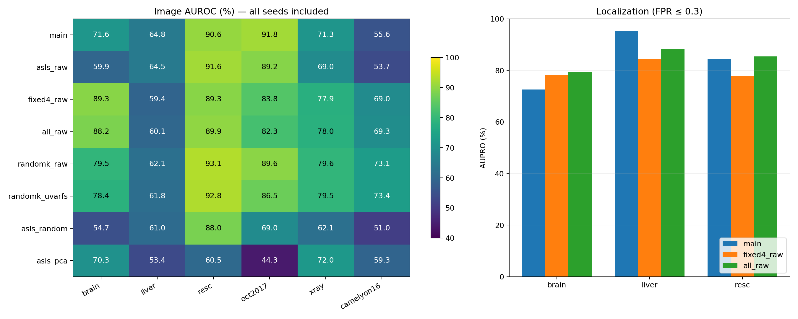

# BMAD v4 回传分析（2026-10-06）

这轮完成六数据集全部 168 行（28 方法/数据集）和 Brain/Liver/RESC 像素评价。主方法 Macro Image AUROC=74.26%，Fixed-4 Raw=78.12%，同 K Random Raw 五 seed 均值=79.47%。层选择仍是主要诊断对象，不能宣称主方法整体胜过固定/随机层。

主线始终是 Frozen DINOv3 + Adaptive Sparse Layer Selection + U-VaRFS 的无异常标签医学异常检测研究；本报告没有用测试标签选择层、lambda、维度或 detector 参数。

## 完整性与来源

- 实验版本 `gpu-eval-v4-protocol-fixes`，Git revision `0295e552a5cf0ddf3c16e41d8a7ea69a7020f32b`；六份 config/code fingerprint 一致。
- 全局 CSV 与逐数据集 CSV 相符；全部逐图 AUROC/AP 重新计算与 CSV 相符，family mean/SD 重新计算与回传 summary 相符。
- 保存的 config 内容与指纹相符；记录的 Git commit 源码字节与服务器 code fingerprint 核验相符。
- 训练与 memory manifest 为正常 train 数据；全部方法共享 memory 图像、patch、reservoir 抽样，均有 20000 bank rows。
- Brain/Liver/RESC 异常 mask 分别覆盖 3075/3075、660/660、764/764；像素指标完整。
- 只读取版本目录；根目录的 v3 汇总不能与 v4 混合。源文件哈希见 `analysis_data.json`。

## 主结果

指标为百分数；层与维度由 normal-only fit 决定。

| dataset | selected_layers | feature_dim | image_auroc | image_auprc | pixel_auroc | pixel_auprc | aupro |
| --- | --- | --- | --- | --- | --- | --- | --- |
| brain | 2;4 | 250 | 71.55 | 90.39 | 93.61 | 26.48 | 72.60 |
| liver | 4;3 | 228 | 64.78 | 55.66 | 98.34 | 17.32 | 95.10 |
| resc | 4;3 | 220 | 90.57 | 89.89 | 97.00 | 50.31 | 84.45 |
| oct2017 | 2;1 | 95 | 91.75 | 96.25 | n.a. | n.a. | n.a. |
| xray | 2;1 | 87 | 71.33 | 97.86 | n.a. | n.a. | n.a. |
| camelyon16 | 1;2 | 143 | 55.60 | 54.44 | n.a. | n.a. | n.a. |

Liver localization 是正向证据：主方法 Pixel AUROC=98.34%、Pixel AP=17.32%、AUPRO=95.10%；RESC AUPRO 提升而 Pixel AUROC/AP 低于 All Raw；Brain 的 image 与 pixel 表现均明显落后 Fixed-4 Raw。Pixel AP 不能由很高的 Pixel AUROC 代替。

## 公平对照与配对不确定性

Image AUROC 百分数；全部 Random 行为五 seeds 的 mean ± sample SD。

| dataset | main | fixed4_raw | asls_raw | randomk_raw | randomk_uvarfs | asls_random | asls_pca |
| --- | --- | --- | --- | --- | --- | --- | --- |
| brain | 71.55 | 89.32 | 59.88 | 79.50 ± 1.66 | 78.40 ± 2.01 | 54.72 ± 6.28 | 70.35 |
| liver | 64.78 | 59.35 | 64.53 | 62.06 ± 1.25 | 61.75 ± 1.37 | 61.04 ± 7.40 | 53.42 |
| resc | 90.57 | 89.32 | 91.59 | 93.06 ± 0.97 | 92.85 ± 1.13 | 87.99 ± 6.11 | 60.51 |
| oct2017 | 91.75 | 83.84 | 89.20 | 89.55 ± 5.27 | 86.49 ± 9.27 | 68.98 ± 10.43 | 44.30 |
| xray | 71.33 | 77.88 | 69.03 | 79.57 ± 1.75 | 79.46 ± 1.91 | 62.08 ± 3.45 | 72.04 |
| camelyon16 | 55.60 | 69.01 | 53.66 | 73.08 ± 3.40 | 73.40 ± 3.21 | 51.03 ± 4.26 | 59.27 |

Random-K 与 ASLS 的层数相同（本轮均为 K=2），五 seeds 全部纳入。主方法只在 Liver/OCT2017 的 Image AUROC 高于 Random-K Raw/Random-K U-VaRFS 均值。Random/PCA 仍为 baseline，不替换 main。

在相同 ASLS 层输入下，U-VaRFS 在六数据集均高于同维度 Random feature 均值、四个数据集高于 PCA、五个数据集高于 Raw；RESC 相对 Raw 有下降。这支持继续诊断该模块，但尚不能支持完整方法跨模态优于固定/随机层。

下表采用 2000 次 image-level、按正常/异常分层、同一图像配对 bootstrap；差值为 Main 减 baseline，单位百分点。Random 行每次 draw 内计算五个 seed 的 AUC 均值，未将预测均值当成 ensemble。区间仅评价固定方法，不用于拟合或调参。

| dataset | comparison | delta_auroc | ci95_lower | ci95_upper |
| --- | --- | --- | --- | --- |
| brain | fixed4_raw | -17.76 | -20.10 | -15.36 |
| brain | asls_raw | +11.68 | +10.08 | +13.21 |
| brain | randomk_raw | -7.95 | -10.09 | -5.69 |
| brain | randomk_uvarfs | -6.85 | -9.02 | -4.59 |
| brain | asls_random | +16.83 | +15.07 | +18.54 |
| liver | fixed4_raw | +5.42 | +3.38 | +7.45 |
| liver | asls_raw | +0.24 | -0.52 | +0.94 |
| liver | randomk_raw | +2.71 | +1.46 | +3.95 |
| liver | randomk_uvarfs | +3.02 | +1.77 | +4.30 |
| liver | asls_random | +3.74 | +2.90 | +4.53 |
| resc | fixed4_raw | +1.26 | -0.19 | +2.69 |
| resc | asls_raw | -1.02 | -1.63 | -0.43 |
| resc | randomk_raw | -2.49 | -3.46 | -1.50 |
| resc | randomk_uvarfs | -2.27 | -3.27 | -1.27 |
| resc | asls_random | +2.58 | +1.86 | +3.31 |
| oct2017 | fixed4_raw | +7.91 | +5.32 | +10.61 |
| oct2017 | asls_raw | +2.55 | +0.20 | +4.91 |
| oct2017 | randomk_raw | +2.20 | -0.03 | +4.41 |
| oct2017 | randomk_uvarfs | +5.26 | +2.88 | +7.57 |
| oct2017 | asls_random | +22.77 | +20.19 | +25.32 |
| xray | fixed4_raw | -6.55 | -8.23 | -4.90 |
| xray | asls_raw | +2.30 | +1.48 | +3.09 |
| xray | randomk_raw | -8.24 | -9.76 | -6.60 |
| xray | randomk_uvarfs | -8.13 | -9.63 | -6.45 |
| xray | asls_random | +9.26 | +8.15 | +10.40 |
| camelyon16 | fixed4_raw | -13.41 | -16.24 | -10.40 |
| camelyon16 | asls_raw | +1.94 | +0.50 | +3.43 |
| camelyon16 | randomk_raw | -17.48 | -20.05 | -14.73 |
| camelyon16 | randomk_uvarfs | -17.80 | -20.41 | -15.03 |
| camelyon16 | asls_random | +4.56 | +2.95 | +6.24 |

没有独立患者/slide 分组 manifest，这些区间不控制同一患者或 slide 内相关性；没有进行多重比较校正或预设 non-inferiority 检验，不能据此宣称患者级显著性/非劣。

## 正常训练诊断

| dataset | pooled_gram_mean | gate_span | gate_variability_rank | uvarfs_error | step_change | projected_residual |
| --- | --- | --- | --- | --- | --- | --- |
| brain | 0.9908 | 0.000586 | 1.000 | 0.05217 | 1.03e-05 | 2.06e-08 |
| liver | 0.9912 | 0.000589 | 1.000 | 0.05769 | 4.22e-05 | 6.75e-08 |
| resc | 0.9944 | 0.000560 | 1.000 | 0.07117 | 1.79e-05 | 4.77e-08 |
| oct2017 | 0.9311 | 0.000559 | 1.000 | 0.06285 | 4.57e-05 | 1.56e-07 |
| xray | 0.9716 | 0.000578 | 1.000 | 0.05325 | 2.62e-05 | 1.27e-07 |
| camelyon16 | 0.9337 | 0.000597 | 1.000 | 0.05846 | 1.39e-05 | 8.30e-08 |

六个 pooled consensus Gram 的 off-diagonal 均值 0.93–0.994，Brain/Liver/RESC 接近常数。所有 gates 接近全开且排序与 variability 同向。按当前目标，类似 Gram 的共同 gate p 使几何项约为 1-p；这一结构推动全开，微小 gate 差异再决定离散前缀。正常 pooled 几何可行性不代表局部 patch 几何或 anomaly 性能已保存。

可考虑在同一主线内用采样 normal patch geometry，保留原 sigmoid/Adam/loss 和 pooled 消融；主方法的输入切换需明确授权，并另立版本，不能根据 test AUROC 选版本。工程等价的 layer-Gram 内积矩阵可以避免存储全部 patch Gram。

六个 U-VaRFS main 均使用最小 lambda=1e-6，最终几何误差 0.052–0.071，全部不满足 0.05，使用原协议 minimum-error fallback。投影残差很小而相邻迭代变化未达 1e-5：不能把 solver_converged=false 简化为优化仍远离驻点，也不能凭小残差证明 feature support 稳定。需要严格 matmul 精度、逐 lambda momentum restart、原目标值与 box optimality-gap 证据。

保持 beta、lambda grid、geometry tolerance 和预算；额外 lambda=0 可作为 normal-only 不可行原因诊断，不能自动加入主选择路径。最终几何可行性与数值收敛是两件事。

## 稀疏与效率

主方法 2/12 层、87–250/4608 维；压缩率高不能自动推出总体显存或 backbone forward 加速。fit/memory/eval/peak 是整数据集全部方法共享量；matching_and_aggregation_seconds 只含 NN 与 image Top-K，未覆盖 feature transform、pixel metric 和绘图。

以全层 4608 维计算的 compression_ratio 包含层与特征两步裁剪；仅 U-VaRFS 阶段是选中两层的 768 维压缩到 87–250 维，不能把两步压缩率全部归功于特征选择。

下表 compression_ratio 为百分数，时间为秒，peak_gpu_gb 为 GiB；fit/memory/eval/peak 为共享整套方法开销，memory_vector_fp16_mib 仅为该方法向量容量。

| dataset | selected_layer_count | feature_dim | candidate_dim | compression_ratio | memory_vector_fp16_mib | matching_and_aggregation_seconds |
| --- | --- | --- | --- | --- | --- | --- |
| brain | 2 | 250 | 4608 | 94.575 | 9.537 | 1.599 |
| liver | 2 | 228 | 4608 | 95.052 | 8.698 | 0.564 |
| resc | 2 | 220 | 4608 | 95.226 | 8.392 | 0.665 |
| oct2017 | 2 | 95 | 4608 | 97.938 | 3.624 | 0.29 |
| xray | 2 | 87 | 4608 | 98.112 | 3.319 | 5.185 |
| camelyon16 | 2 | 143 | 4608 | 96.897 | 5.455 | 0.668 |

全部方法 memory bank 均为 20000 rows；下面的耗时/显存为整数据集全部方法共享量。

| dataset | fit_seconds | memory_seconds | eval_seconds | peak_gpu_gb |
| --- | --- | --- | --- | --- |
| brain | 10.841 | 11.155 | 595.837 | 2.197 |
| liver | 10.467 | 11.233 | 253.321 | 2.177 |
| resc | 10.361 | 11.384 | 301.858 | 2.181 |
| oct2017 | 10.35 | 11.04 | 70.633 | 2.137 |
| xray | 10.671 | 11.599 | 480.513 | 2.152 |
| camelyon16 | 10.317 | 10.709 | 98.617 | 2.149 |

本轮带 mask 的 evaluation 开销远大于 NN matching。新版共享同图像 mask 连通域，pixel histogram 与 normal PRO counts 复用一次排序；保留原 1024 bins、100 thresholds、≥ ties 与 FPR=0.3。局部 CPU fixture 与 v4 对照的全部计数和最终指标完全一致，中位耗时比约 1.63（详见 pixel_equivalence_benchmark.json），不能外推为服务器整套实验加速。

回传 heatmap 使用固定 0–2 cosine distance 色阶，抽查样例对比度较低；不根据这些叠加图单独宣称定位效果，应结合 pixel AP/AUPRO 和原始分数。

## 类别比例

| dataset | normal | abnormal | image_positive_prevalence | main_image_auprc |
| --- | --- | --- | --- | --- |
| brain | 640 | 3075 | 0.827725 | 0.903905 |
| liver | 833 | 660 | 0.442063 | 0.556569 |
| resc | 1041 | 764 | 0.423269 | 0.898875 |
| oct2017 | 242 | 726 | 0.75 | 0.962525 |
| xray | 781 | 16413 | 0.954577 | 0.978617 |
| camelyon16 | 1003 | 994 | 0.497747 | 0.544374 |

X-ray 异常比例约 95.46%，无技巧 AP 基线即该比例；主方法 AP=97.86% 要结合这一比例解释，同时保留 Image AUROC=71.33%。

## 修改边界与复跑

代码修改前检查：不改变研究问题、Frozen backbone、normal-only 约束、U-VaRFS 目标、cosine 1-NN 或统一预算；数值输出变化必须换版本与结果目录。ASLS geometry 输入若升级，需明确标注并保留 pooled 对照。

本次 v5 默认主 ASLS 仍用 pooled geometry；新增 asls_patch_raw/asls_patch_uvarfs 消融，并保留原 28 方法和五 seeds。patch 主方法切换需按 AGENTS.md 第 19 节得到明确指令，未静默启用。数值与诊断修改、复跑命令见 [修改说明](../../RESULT_DRIVEN_FIXES.md)。

当前工作机没有真实 BMAD 数据/权重或 CUDA PyTorch，因此本地只能验证数学、CPU fixture、统计与工程等价性。新版性能需先 Liver 验证，再六数据集复跑；不能用本轮 test metrics 选择新的训练超参数。

来源：版本目录的 all_metrics/summary_metrics、六数据集 metrics/image_predictions/asls/uvarfs/fit_manifest/memory_manifest/run_metadata/mask_coverage/eval_progress。报告不会改写原实验产物。
